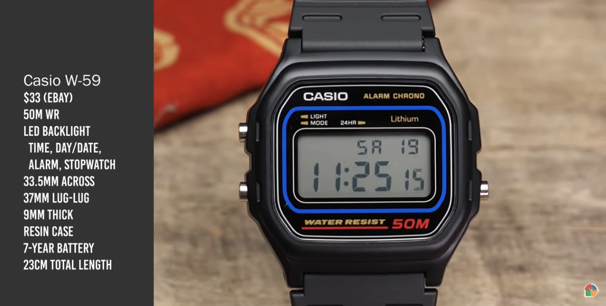
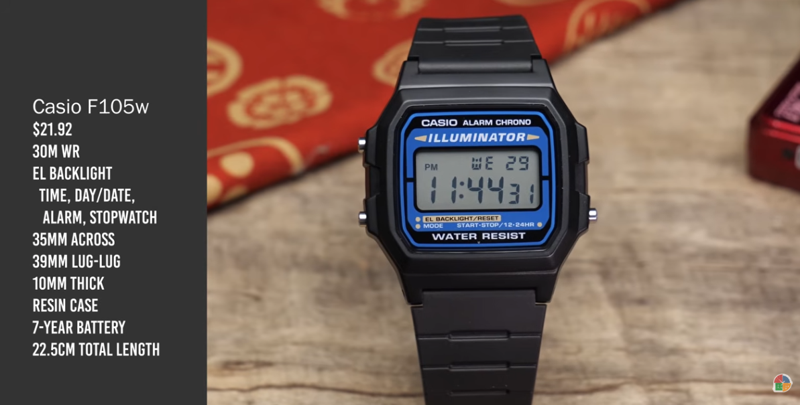
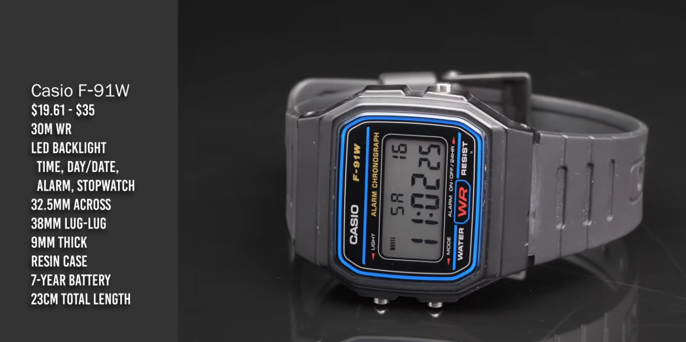
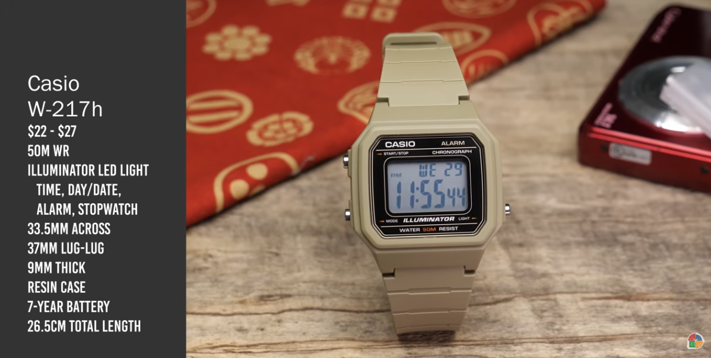

*Sist oppdatert: 27.05.2026*

Intro
-----
I går, **6. mai 2026**, mottok jeg pakke i posten med mine **tre nye Casioklokker**.
De ble kjøpt etter inspirasjon av `Stop Buying the Casio F-91W (Get These Instead) <https://www.youtube.com/watch?v=TfFg_RifcQE>`__.
Fikk tak i følgende, men mangler ``w217h``, som jeg også tenke meg å teste:

* `f-91w <https://www.urverket.no/casio/youth/f-91w-1yeg/1169152>`__
* `f-105w <https://www.urverket.no/casio/collection/f-105w-1awyef/17637>`__
* `w-59 <https://www.urverket.no/casio/collection/w-59-1vqes/17980>`__
* `w-217h <https://www.urverket.no/casio/classic/w-217h-1avdf/885621>`__ - **ny**, 14.mai.

Den 14. mai endte jeg nå opp med å kjøpe ``w-217h``.
Da får jeg **alle** klokkene som jeg synes er relevante for meg fra videoen over.

Utpakking gikk fint.
I dag prøver jeg ``w-59``'en.

Samtlige av klokkene - inkludert min gamle ``f-91w`` og ``ae-1200``, fikk tiden stilt presist ca. kl. 23:30 den **6.mai**.
Dette gir **UNIX time**::

  $ date -d '2026-05-06 23:30' +'%s'
  1778103000

Sjekk driften på dem om et par ukers tid.
Mon tro om den *nye* ``f-91w`` har samme drift som den *gamle*..?

*Oppdatering 27. mai:*
Så er ``w-217h`` hentet på posten.
Jeg skal straks *unboxe*.

Denne ble stilt 23:45 den **27.mai**, **UNIX time**::

  $ date -d '2026-05-27 23:45' +'%s'
  1779918300

----

Logg
----
Under følger oversikt over klokker jeg har testet.

.. list-table:: Testoversikt - klokker
  :header-rows: 1

  * - Klokke
    - Fra dato
    - Til dato
  * - ``w-59``
    - 7. mai
    - 13. mai
  * - ``f-105w``
    - 13. mai
    - 20. mai
  * - ``f-91w``
    - 20. mai
    - 27. mai
  * - ``w-217h``
    - 27. mai
    - TBA

----

Review
------
``w-59``
""""""""
Så har jeg hatt på meg ``w-59`` i én uke.
Det er egentlig veldig lite å si - på den gode måten.
Den likner veldig - og føles utrolig - lik, ``f-91w``.
Lite oppsiktsvekkende, på den gode måten.

Next up, ``f-105w``.

``f-105w``
""""""""""
Så har jeg gått med ``f-105w`` i én uke.
Det første jeg tenker, er at dette er en klokke som ser skikkelig tøff ut, med den blå farge, og *litt* kantete uttrykket.
Denne likte jeg veldig godt.
Next up er klassikeren... ``f-91w``.

*PS: venter på at * ``w-217h`` *kommer i postkassen.*

``f-91w``
---------
Så har det vært klassikerens uke, nemlig ``f-91w``.
Som forventet var dette en følelse jeg hadde godt i minne.
Størrelsen er liten, den nærmest smelter bort på armen.
Det dårlige, dog sjarmerende, *backlighten*.
Som med de andre modellene jeg har prøvd så får jeg av og til på fornemmelsen at reimen er *litt mindre og trangere*, enn den var på min originale ``f-91w``.
Jeg vil tro at objektivt sett er reimen helt lik.
Reimen gir seg muligens litt over tid.

Next up er klokken det kanskje knytter seg mest spenning til, nemlig ``w-217h``.

``w-217h``
----------
Kommer!

Drift
-----
Her fører jeg driften de ulike klokkene har.
Man kan oppgi drift som sek/24h, sek/h, sek/sek, etc.
Også interessant å føre *reciprocal* av dette, altså hvor mange dager tar det før klokken har driftet ett sekund.

* ``f-91w``:
* ``f-105w``:
* ``w-59``:
* ``ae-1200``:

----

To-do
-----
* [x] Legg til bilde(r).
* [ ] Sjekk drift av klokkene etter stilling den 7. mai.
