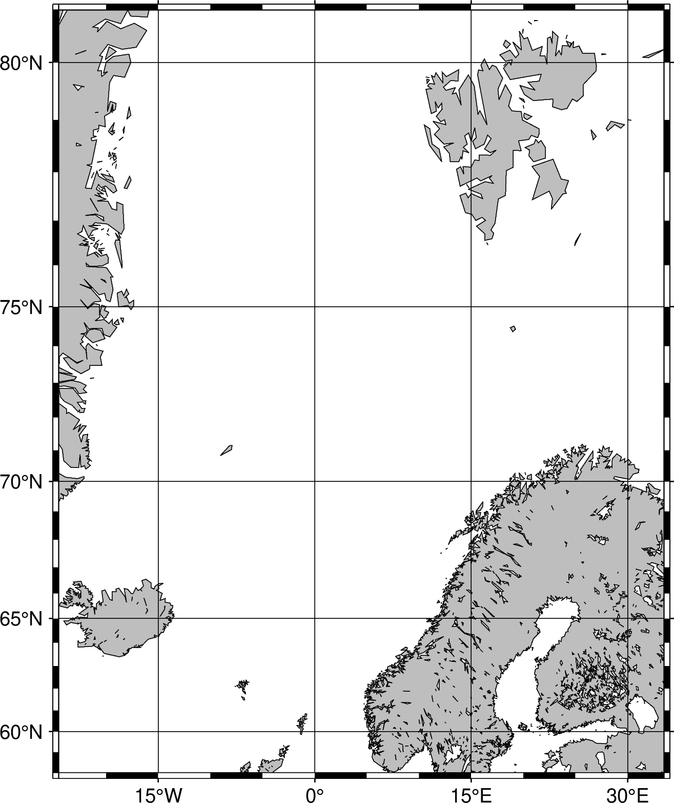

+++
title = 'Sjøfjellatlas'
date = 2026-03-12T14:47:31+01:00
draft = false
+++

# Idé
Lag et atlas av sjøfjell på norsk sokkel.
* Lag prominencepunkter, og kjør en for loop for hvert punkt som lager et fint utsnitt av området.
  Bruk e.g. ``-R<radius>`` for å lage region.
* Plott prominence- og saddle-punktet.
* Plott koter, og highlight koten som har samme verdi som **saddle-punktet**.
  Dette illustrerer bra hva som danner *sokkelen* på sjøfjellet

Start med å lage **dummyskript** som plotter dummyposisjoner, bare for å se at det fungerer.

# Bakgrunn

Etter disse to artiklene:

* https://www.abcnyheter.no/livsstil/kanarioyene-vulkan-under-havet-er-aktiv/1465844
* https://www.canariajournalen.no/nyheter/2026/03/aktivitet-pavist-i-vulkan-pa-kanarioyene

Søkte jeg på dette og fikk følgende resultater:

* https://www.google.com/search?q=sea+mount+mediano
* https://portals.iucn.org/library/sites/library/files/documents/2015-043-intro_chp.1.pdf
* https://www.icm.csic.es/en/news/csic-detects-hydrothermal-activity-first-time-submarine-volcano-located-between-tenerife-and
* https://www.hi.no/en/hi/nettrapporter/rapport-fra-havforskningen-en-2019-42
* https://www.whoi.edu/ocean-learning-hub/ocean-topics/how-the-ocean-works/seafloor-below/seamounts/
* https://oceanexplorer.noaa.gov/ocean-fact/seamounts/
* https://oceanexplorer.noaa.gov/expedition-feature/okeanos-ex1905-background-canyons-seamounts/
* https://www.researchgate.net/publication/295531643_1_Seamounts_and_Seamount-like_Structures_of_the_Alboran_Sea

# Figurtest

Funker det med figurer her?

Her er resultatet for ``gmt coast -RNO,SJ,IS -JM10c -W -Bxafg -Byafg -png map``::

Jepp, det funket.
